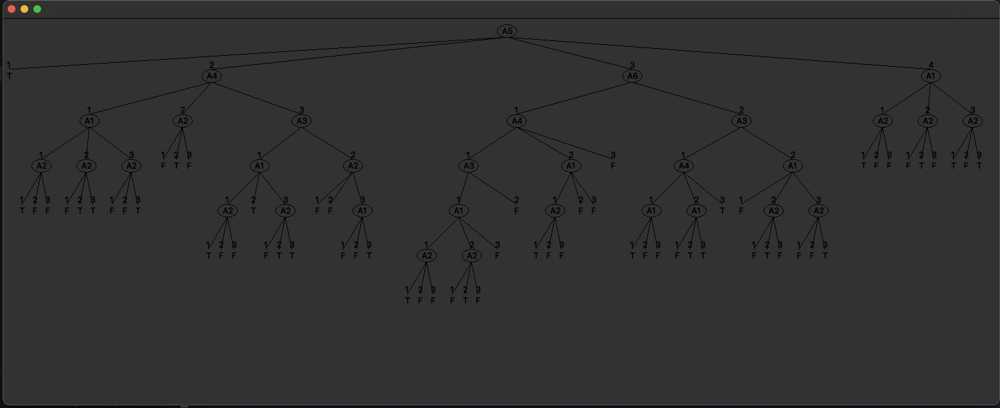
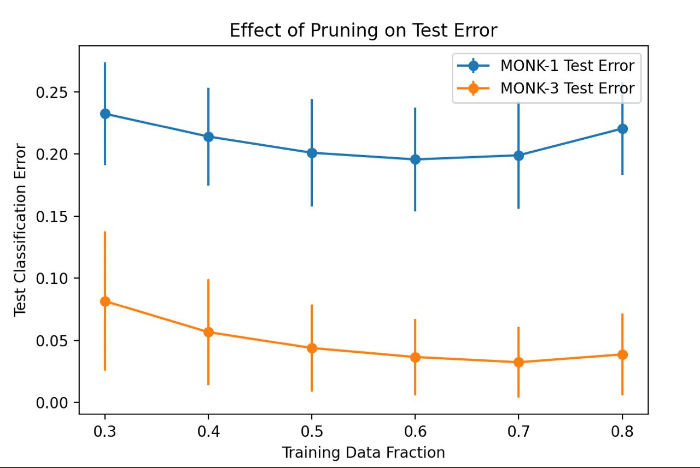

# dd2421-Lab1

Lab 1 for course DD2421 Machine Learning.
Team memebers:

- Zhilia Hamad
- Samvel Hovhannisyan

## Monk Datasets

### Assignment 0

MONK2 will be the most difficult problem to learn with decision tree because the result is dependent on all attributes and the predictor space has to be split into lots of regions.
Every attribute gives equal amount of information.

## Entropy

### Assignment 1

| Dataset | Entropy |
| ------- | ------- |
| MONK-1  | 1.0     |
| MONK-2  | 0.9571  |
| MONK-3  | 0.9998  |

### Assignment 2

A uniform distribution means that all outcomes are equally likely, which results in maximum entropy due to the high uncertainty.

Example: Rolling a die

$p_1=\frac{1}{6},p_2 = \frac{1}{6},...,p_6 =\frac{1}{6} \Rightarrow Entropy = \sum{p_i} = 6 \cdot -\frac{1}{6} \log_{2}(\frac{1}{6}) ≈ 2.58$

A non-uniform distribution means that some outcomes are more likely than others, making it more predictable and results in lower entropy.

Example: Rolling a fake die

$p_1 = 0.5, p_2 = 0.1; ... , p_6 =0.1 \Rightarrow Entropy = \sum{p_i} = - 0.5 \cdot \log_{2}(0.5) - 5 \cdot 0.1 \log_{2}(0.1) ≈2.16$

## Information Gain

### Assignment 3

| Dataset | a1 | a2 | a3 | a4 | a5 | a6 |
| ------- | -- | -- | -- | -- | -- | -- |
| MONK-1  | 0.075272 | 0.0058384 | 0.0047075 | 0.0263116 | 0.2870307 | 0.0007578 |
| MONK-2  | 0.003756 | 0.0024584 | 0.0010561 | 0.0156642 | 0.0172771 | 0.0062476 |
| MONK-3  | 0.007120 | 0.2937361 | 0.0008311 | 0.0028918 | 0.2559117 | 0.0070770 |

The best choice of attribute to split the root node depends on which dataset we are trying to create a decision tree for. If the decision tree is for MONK-1 then a5 is the best attribute to split on, in the case for MONK-2 again a5 has greatest average information gain for the training set so according to the heuristic it will be selected for split at root node. Finally for MONK-3 root node split will be selected for attribute a2.

### Assignemnt 4

When the information gain is maximized, the entropy of the subsets $S_k$ after the split is minimized. We can use information gain as a heuristic because a high information gain means that the attribute creates subsets with lower uncertainty. This large reduction in entropy means the attribute was very informative for classification (makes the classification task easier) It also ensures that the decision tree generelizes well.

## Building Decision Trees

Here is the tree build with 2 levels / splits:

And here is the tree that `buildTree()` builds with no specified maxdepth:

### Assignment 5

The information gain on the the four nodes after the first split on attribute \(a_5\) is shown in the table.

| Monk-1  / \(a_5\)  | \(a_1\)   | \(a_2\)   | \(a_3\)   | \(a_4\)   | \(a_6\)   |
|----------|----------|----------|----------|----------|----------|
| Node 1 | 0.00000  | 0.00000  | 0.00000  | 0.00000  | 0.00000  |
| Node 2 | 0.04022  | 0.01506  | 0.03727  | 0.04889  | 0.02581  |
| Node 3 | 0.03306  | 0.00220  | 0.01798  | 0.01912  | 0.04511  |
| Node 4 | 0.20629  | 0.03390  | 0.02591  | 0.07593  | 0.00332  |

| Dataset  | Error Training | Error Test |
|----------|---------------|------------|
| MONK-1   | 0.0           | 0.1713     |
| MONK-2   | 0.0           | 0.3079     |
| MONK-3   | 0.0           | 0.0556     |

## Pruning

### Assignment 6

Pruning reduces overfitting by trimming parts of a tree that do not provide significant improvements in classification accuracy on a separate validation dataset. A fully grown tree has low bias but high variance, meaning it memorizes the training data, including noise. By pruning, we make the model more stable and generalizable, reducing variance but increasing bias (in other words, trading off variance for bias). The goal is to find the right balance where the model is neither too complex (overfitting) nor too simple (underfitting).

### Assignment 7

The following observations are made about the plot:

•⁠  ⁠As the training fraction increases, test error generally decreases or stabilizes, which is expected since more training data leads to better generalization.

•⁠  ⁠For MONK-3, the test error is consistently lower than for MONK-1, which aligns with the fact that MONK-3 is easier to learn after pruning due to the underlying rule being relatively structured and identifiable, showing that pruning has been effective in reducing some of the noise.

•⁠  ⁠Larger error bars for smaller training fractions suggest higher variance in performance, which is logical because models trained on less data are more sensitive to variation.

